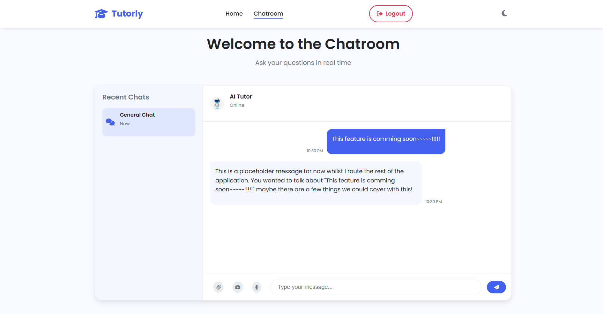
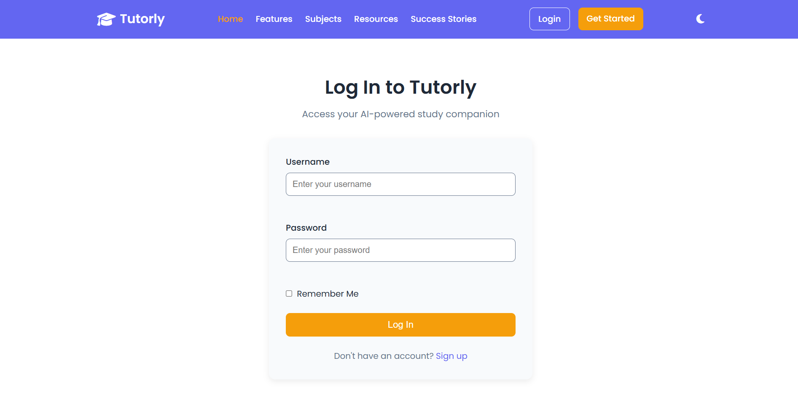

## 📚 Tutorly – Beta Version  


Tutorly is an all-in-one tutoring platform connecting students with tutors through a modern, responsive web interface. 
It features secure authentication, session management, dynamic rendering, and is built with AI integration in mind. 🧠✨

---

### 🚀 Tech Stack

<div align="center">

<!-- Skillicons -->


<!-- Custom EJS Badge -->
<br/>


</div>

---

## 👨‍💻 Authors

- **Arsheet**  
  *Frontend Developer*  
  [GitHub](https://github.com/Arsheetkaur) | [LinkedIn](https://www.linkedin.com/in/arsheet-kaur-94b207346)

- **Dhiraj**  
  *Backend Developer*  
  [GitHub](https://github.com/dhirajdhande19) | [LinkedIn](www.linkedin.com/in/dhiraj-dhande-1a7262237)

- **Nebin**  
  *AI Integration Lead*  
  [GitHub](https://github.com/neb1n) | [LinkedIn](https://www.linkedin.com/in/nebin-babu-417a03353)

> 💬 Built with teamwork, late nights, and way too much console logging. 😂

---

<details>
<summary>🛠️ Local Setup Instructions (Optional)</summary>

<br/>

### 1️⃣ Clone the Repository

````bash
git clone https://github.com/your-username/tutorly.git
cd tutorly
````

### 2️⃣ Install Dependencies
````bash
npm install
````

### 3️⃣ Set Up Environment Variables
Create a .env file in the root directory and add:

````bash
MONGO_URL=your_mongo_connection_string        
SECRET="your_secret_code"
````

### 4️⃣ Run the Server

````bash
nodemon server.js
````
Then open your browser at:
 ````bash 
 http://localhost:2000
````

</details>

---

## 🗂️ Project Folder Structure

```plaintext
tutorly/
│
├── controllers/
│   └── authController.js       # Handles authentication logic
│
├── models/
│   └── User.js                 # User schema using Mongoose
│
├── public/
│   ├── css/                    # CSS stylesheets
│   ├── js/                     # Client-side JavaScript
|   └── images/                 # Images                  
|
├── routes/
│   └── authRoutes.js           # Routes for login, register, logout
│
├── utils/
│   ├── ExpressError.js         # Custom error class
│   └── wrapAsync.js            # Utility for async error handling
│
├── views/
│   
│   ├── includes/
│   │   ├── navbar.ejs
│   │   ├── flash.ejs
│   │   ├── chatroomHeader.ejs
│   │   └── footer.ejs          
│   │   
│   └── layout/
│   │    ├── loginBoilerplate.ejs
│   │    ├── registerBoilerplate.ejs
│   │    ├── chatroomBoilerplate.ejs
│   │    └── homeBoilerplate.ejs
│   │
│   │
│   └──pages/                    # EJS Files
│        ├── chatroom.ejs
│        ├── error.ejs            
│        ├── home.ejs
│        ├── login.ejs
│        └── register.ejs
|
│
├── middlewares.js             # Custom middleware functions
├── server.js                  # Entry point of the app
├── .gitignore                 # Ignored files/folders
└── README.md                  # You're here now!
│.....

```

---

## 🌍 Live Demo

Check out the deployed version here: [Tutorly Live Site](https://tutorly-jyu9.onrender.com)


---

## 📸 Screenshots

| Home Page | Chatroom | Register | Login |
|-----------|----------|----------|-------|
|  |  |  |  |

> 📌 *Note: Screenshots are from the beta version and will evolve as we improve the platform.*

---

## ✨ Features

- 🔐 Authentication (Register/Login)
- 👥 Real-time Chatroom (coming soon / in progress)
- 📄 Dynamic EJS Templating
- 🧠 AI Assistant (under development)
- ⚙️ Error Handling and Flash Messaging

---

## 🚧 Upcoming Improvements

- Real-time chatroom using Socket.io
- AI tutor assistant integration
- Responsive mobile-first layout

---
## 📌 Notes

* Don't commit your `.env` file! It's ignored by `.gitignore`.

---

## 🌟 Like this project?

Star it ⭐ | Fork it 🍴 | Share it 💬

We’re continuously improving — contributions and feedback are welcome!


